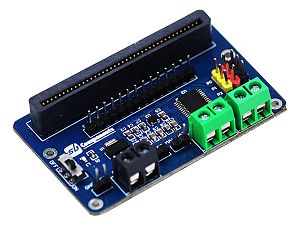
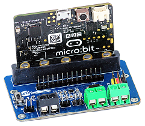

# Micro-Bit-Motor-Driver
A motor driver module designed for the BBC micro:bit. This module can drive 2 DC motors and 3 Servo motors.

 

### Features
* Micro:bit edge connector to connect Micro:Bit directly on module.
* Onboard connectors to connect upto 2 DC motors and 3 servo motors
* Vin 5-12 Volts input , output upto 3A

### Specification
* Power input range: 5V~12V
* Output voltage: 5V
* Logic voltage: 3.3V
* Driver: TB6612FNG
* Dimension: 65mm x 41mm
* Holes size: 2.0mm

### Pinouts and Connectors

| PIN/CON | Description |
| ------- | ----------- |
| VIN | Power (5~12V) |
| GND | Ground |
| MA1 | Positive pole of motor A |
| MA2 | Negative pole of motor A |
| MB1 | Positive pole of motor B |
| MB2 | Negative pole of motor B |
| P0 | Control pin P0 of Servo 1 |
| P1 | Control pin P1 of Servo 2 |
| P2 | Control pin P2 of Servo 3 |

## Programming Guide
